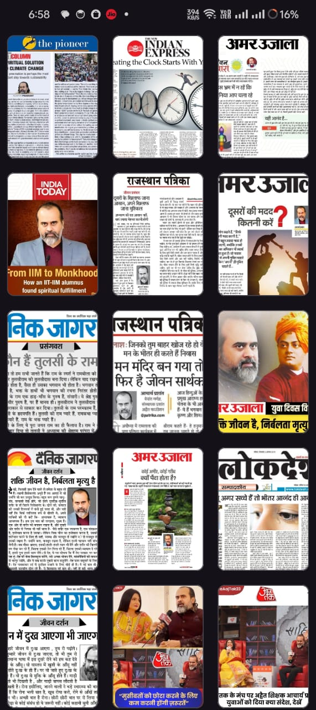

# Image Loading App

## Overview

Developed an application for Android to efficiently load and display images in a scrollable
grid.

## Features

1. **Data Fetching:**
   - Data is fetched from the API endpoint [URL](https://acharyaprashant.org/api/v2/content/misc/media-coverages?limit=100) using Kotlin coroutines.

2. **Data Binding:**
   - Data binding is utilized for efficient binding of data to UI components.

3. **Image Loading:**
   - Images are loaded using sonorously without relying on any third-party libraries.

4. **Caching Mechanism:**
   - Images are cached to improve performance, and any changes on the server side are automatically updated in the cache.

5. **UI Design:**
   - The UI utilizes a RecyclerView in a 3-span grid layout for an organized display of images.

## Screenshots

## Video Demo

[![Watch Video]
https://github.com/DevendraDevelopment/MyImages/assets/50836835/340cd97d-4689-4f61-bcbe-a116377322f1

## Development Environment

https://github.com/DevendraDevelopment/MyImages/assets/50836835/1bb3de90-b657-4dea-9787-266a6fbbbd66

- Android Studio Version: 
- AGP Version: 
- Kotlin Version: 
- Testing Device: 

### Fetching Data with Kotlin Coroutines
